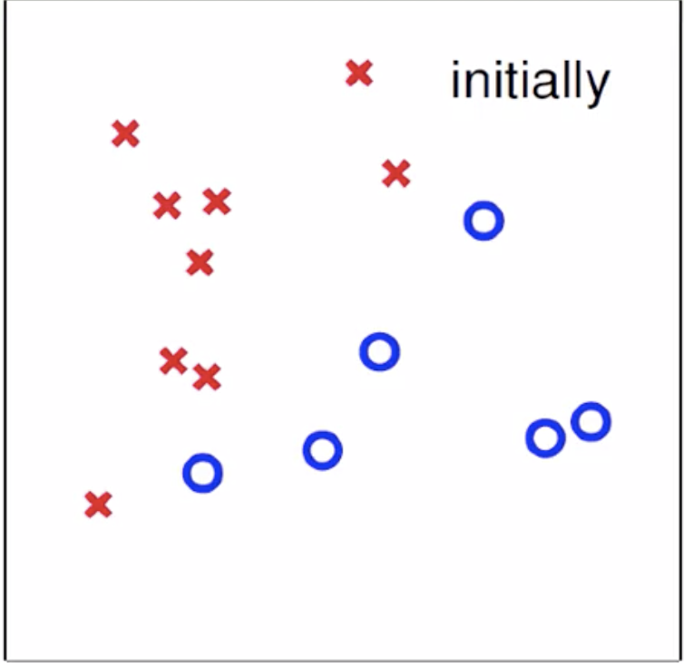
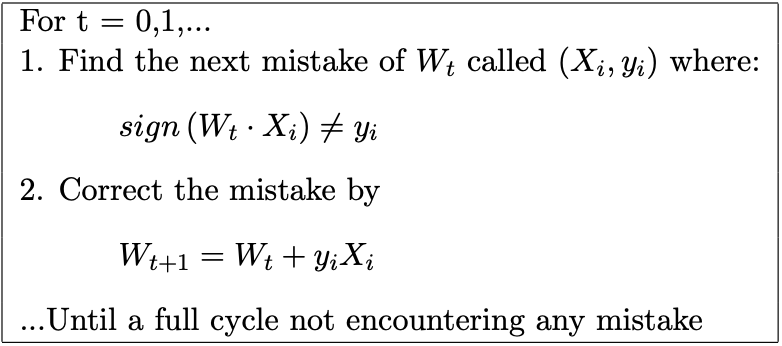

## Perceptron Learning Algorithm(LPA算法)

### 背景介绍

假设现在银行需要给客户发放信用卡，那么银行想通过一些方法来判断说。我应不应该给这个客户发放信用卡呢。那么我们是否可以找到一个函数来告诉我们这个答案？

那么我们的具体的假设的函数是这样的，我们确定每个客户身上的一些特征，我们假设有N个特征，比如年龄、性别、存款等等和客户相关的属性。然后我们有一个W的权重向量，它用来控制这N个特征在这个函数里面的重要程度。影响大的特征我们就给它的权重大，影响小就小一点。然后计算这些特征和权重的乘积之后的和得到这个客户的得分，那么如果客户的得分超过了一个我们约定的阈值threshold，那么久给它信用卡，没有超过则不给。很简单理解的一个方法。

我们假设我们的函数是：

$$h\left ( x \right )=sign\left ( \left ( \sum_{i=1}^{n}w_{i}x_{i} \right )-threshlod\right)$$

其中：
sign代表去结果的正负号，threshold是规定的阈值

$$x_{i}  代表样本X的第i个特征$$
$$w_{i}  代表权重向量的第i个权重$$

很简单的一个函数定义，通俗易懂！

为了让整个函数定义更加清晰，把threshold也合并进去前面的部分，

通过假设W0=-threshold，x0=1来实现

\begin{align*}
h\left ( x \right )&=sign\left ( \left ( \sum_{i=1}^{n}w_{i}x_{i} \right )-threshlod\right)\\\\
&=sign\left ( \left ( \sum_{i=1}^{n}w_{i}x_{i} \right )+(-threshlod) \times (+1)\right)\\\\
&=sign\left ( \sum_{i=0}^{n}w_{i}x_{i} \right)\\\\
&=sign\left ( W\cdot X\right)
\end{align*}

好了，我们得到了我们的这个公式，那么接下来我们需要做的就是通过训练来获取一个完美的公式，

怎么完美？

就是能够很好地根据你的客户，然后输入这个函数都能得到准确的预测值。

那么我们首先需要喂数据给它，让它生成这样的一个函数，这里最重要的就是得到W权重向量，如果我们得到一个完美的W向量，那么输入一个新的客户X就能知道要不要给他发放信用卡了，是不是美滋滋~。

那么我们假设我们的数据在一个二维平面上，现在问题就是找到一条直线能够很好地分离圈圈和叉叉，这些点它们分别代表正样本和负样本

如何找到这样的一条直线，我们可以先随机一条线，然后在遍历样本的时候如果碰到错的点的时候再更正，使得这些条线越来越对。

图片里的第一部分很好理解，假设现在是在第t次迭代下的W权重，我们找到一个错误的点。那么此时计算出来的值和y值不等，

然后我们通过Wt+1=Wt+yiXi来修正这条直线

问题来了

> 为什么Wt+yiXi就能够起到修正的效果呢?

对于正样本 我们的Wt和Xi两个向量的乘积，得到的是负的这代表这两个向量的角度比较大，那么我们要修正成正的，通过加上Xi*yi使得Wt向量更加靠近Xi向量，因此得到修正。
对于负样本 乘积得到我正，代表两个向量的角度比较小(向量乘积=两个向量的模的乘积再乘以它们两个的夹角的cos值)。那么为了修正，我们此时yi的符号为负，所以加上Xi*yi相当于减去Xi，让Wt和Xi之间更加远离。

目前我们找到了修正的方法，那么现在就是开始修正去靠近完美的时候了。

我们在做这个的前提是，假设数据集线性可分，也就是存在这样的一个W*使得，sign(W*Xi)=yi对于所有的(x,y)都成立。

不等式1:对于任意的i来说
\begin{align*}
(y_{i}W^{*}\cdot X_{i})>\min_{j}(y_{j}W^{*}\cdot X_{j})>0,for \quad j \in \left \{ 1...n \right \}
\end{align*}

不等式2:
\begin{align*} 
W^{*}\cdot W^{t+1}&=W^{*}\cdot (W^{t}+X_{i}y_{i})\\
&=W^{*}\cdot W^{t}+y_{i}W^{*}X_{i}\\
&>W^{*}\cdot W^{t}+\min_{j}y_{j}W^{*}\cdot X_{j} ,for \quad j\in \left \{ 1...n \right \}
\end{align*}

由1和2两个式子就可以得到一个结论，就是Wt通过修正得到Wt+1之后和我们要的完美W*更加接近了

这是一个好兆头，不过要注意的是两个向量相乘，可能是角度更近导致内积更大，也可能是向量的长度变长了的原因。

那么下来要证明的就是长度的变化其实并没有多大的改变，

不等式3：
\begin{align*} 
\left \| W^{t+1} \right \|^{2}&=(W^{t}+y_{i}X_{i})^{2}\\
&=\left \| W^{t} \right \|^{2}+2\cdot y_{i}W^{t}X_{i}+(y_{i}X_{i})^{2}\\
&<\left \| W^{t} \right \|^{2}+(y_{i}X_{i})^{2}\\
&<\left \| W^{t} \right \|^{2}+\max_{j}\left \| y_{i}X_{i} \right \|^{2} \quad ,for \ j \in \{1...n\}
\end{align*}

我们可以看到Wt+1其实比Wt只是多了一个常数部分。因此可以得到Wt+1实际上是在角度方面更加靠近我们的完美W*

**有一点需要注意的是 我们上面几个式子大部分都用了那个修正的等式，所以需要记住的是只有当使用错误的样本时，才会用到。**

那么我们继续稍微迭代一下不等式2:
\begin{align*} 
W^{*}\cdot W^{t+1}&=W^{*}\cdot (W^{t}+X_{i}y_{i})\\
&=W^{*}\cdot W^{t}+y_{i}W^{*}X_{i}\\
&>W^{*}\cdot W^{t}+\min_{j}y_{j}W^{*}\cdot X_{j} ,for \quad j\in \left \{ 1...n \right \}\\
&>W^{*}\cdot W^{t-1}+\min_{j}y_{j}W^{*}\cdot X_{j}+\min_{j}y_{j}W^{*}\cdot X_{j}\\
&>W^{*}\cdot W^{0}+T\cdot \min_{j}y_{j}W^{*}\cdot X_{j}
\end{align*}

以及不等式3也是一个道理：

\begin{align*} 
\left \| W^{t+1} \right \|^{2}&=(W^{t}+y_{i}X_{i})^{2}\\
&=\left \| W^{t} \right \|^{2}+2\cdot y_{i}W^{t}X_{i}+(y_{i}X_{i})^{2}\\
&<\left \| W^{t} \right \|^{2}+(y_{i}X_{i})^{2}\\
&<\left \| W^{t} \right \|^{2}+\max_{j}\left \| y_{i}X_{i} \right \|^{2} \quad ,for \ j \in \{1...n\}\\
&<\left \| W^{t-1} \right \|^{2}+\max_{j}\left \| y_{i}X_{i} \right \|^{2}++\max_{j}\left \| y_{i}X_{i} \right \|^{2}\\
&<\left \| W^{0} \right \|^{2}+T\cdot \max_{j}\left \| y_{i}X_{i} \right \|^{2}
\end{align*}

在经过T次迭代后，我们看看W*和Wt之间的靠近程度

\begin{align*} 
\frac{W^{*}\cdot W^{t}}{\left \| W^{*} \right \|\cdot \left \| W^{t} \right \|}&\geq \frac{T\cdot \min_{j}y_{j}W^{*}\cdot X_{j}}{\left \| W^{*} \right \|\sqrt{T}\max_{j}\left \| y_{i}X_{i} \right \|}\\
&\geq \sqrt{T}\cdot \frac{\min_{j}y_{j}W^{*}\cdot X_{j}}{\left \| W^{*} \right \|\max_{j}\left \| y_{i}X_{i} \right \|}
\end{align*}

因此T的上界为
\begin{align*} 
T\leq \frac{\left ( W^{*}\cdot W^{t} \right )^{2}\cdot (max_{i}y_{i}X_{i})^{2}}{\left \| W^{t} \right \|^{2}\cdot (\min_{j}y_{i}W^{*}X_{i})^{2}}\
\end{align*}

也就是说我们经过T次迭代后能够得到这样的W*
